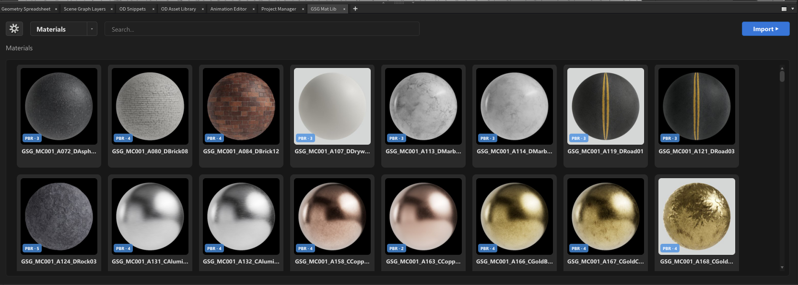

# GSG Mat Lib

Simple Houdini Python Panel for browsing and dropping **materials**, **textures**, and **HDRIs** into a material network.

## Includes
- Materials view
- Textures view
- HDRIs view
- Drag and drop materials
- Drag and drop textures/HDRIs to node file parameters
- Right-click `Copy File Path` / `Copy Material Path`
- Preview thumbnail caching

## Install (quick)
1. Copy this `HoudiniMaterialGallery` folder to your machine.
2. Edit `HoudiniMaterialGallery.json` and set:
   - `HMG_LOCATION` to your local `HoudiniMaterialGallery` folder path.
3. Put `HoudiniMaterialGallery.json` into your Houdini `packages` folder.
4. Restart Houdini.
5. Open the Python Panel: `GSG Mat Lib`.

## Notes
- This package is intentionally clean and does not include ODTools content.
- Supported library tabs right now: `Materials`, `Textures`, `HDRIs`.
- Supports only **Greyscale Gorilla** materials, textures, and HDRIs.
